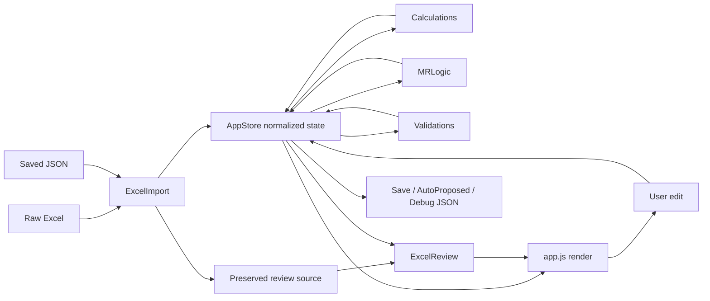

# Architecture

This document describes the current runtime architecture of Pole Span MR Calculator. It documents the existing implementation and does not define a redesign.

## Runtime Model

The application is a static browser application. It has no backend, package manager, build step, or framework. Every module is an IIFE that publishes a small API on `window`.

`index.html` loads modules in dependency order:

1. `libs/xlsx.full.min.js`
2. `js/height-utils.js`
3. `js/project-config.js`
4. `js/state.js`
5. `js/calculations.js`
6. `js/midspan.js`
7. `js/mr-logic.js`
8. `js/validations.js`
9. `js/excel-import.js`
10. `js/excel-review.js`
11. `js/json-export.js`
12. `js/floating-calculator.js`
13. `js/app.js`

Changing this order can break global dependencies. For example, `calculations.js` expects `window.AppStore` and `window.HeightUtils` to exist.

## Module Responsibilities

| Module | Global API | Responsibility |
| --- | --- | --- |
| `height-utils.js` | `HeightUtils` | Parse and format all height values using integer inches. |
| `project-config.js` | `ProjectProfiles` | Keep INTEC and Metronet defaults outside calculation code. |
| `state.js` | `AppStore` | Own and normalize the single application state. |
| `calculations.js` | `Calculations` | Derive pole limits, power limits, comm midspans, Proposed results, End Drop, auto movements, and flagging. |
| `midspan.js` | `MidspanLogic` | Small midspan-oriented facade over the store and calculations. |
| `mr-logic.js` | `MRLogic` | Generate ordered Make Ready text for each pole. |
| `validations.js` | `Validations` | Generate broad data-integrity warnings. Table flagging remains in `calculations.js`. |
| `excel-import.js` | `ExcelImport` | Convert Excel worksheets or saved data into normalized AppState entities. |
| `excel-review.js` | `ExcelReview` | Audit preserved workbook rows against current calculated and MR state without rendering HTML. |
| `json-export.js` | `ProjectExport` | Produce AutoProposed and diagnostic JSON downloads. |
| `app.js` | browser event handlers | Render the UI, process edits, manage undo, Save/Load, Update Data, dialogs, and targeted refreshes. |

## Data Flow

The store is mutable by design. A normal edit follows this lifecycle:

1. `app.js` records an undo snapshot.
2. The edit is normalized and written through `AppStore` or `Calculations`.
3. The affected span, pole, remote endpoint, and reciprocal wire rows are recalculated.
4. Make Ready and validations are regenerated.
5. Affected pole cards are rendered again.
6. The job is marked dirty until Save succeeds.

`render()` also calls `recalculateAll()` before drawing the full workspace. This protects imports, undo restores, and loaded JSON from displaying stale derived values.

Excel Review results live in module memory rather than AppState. The store retains only the original headers and rows needed to rerun the audit. A successful raw import or Update Data recalculates the calculator, runs `ExcelReview.runReview()`, then renders without changing the active view. A failed import does not run the review.

## Graph Model

Poles are graph nodes and spans are directed imported edges. Direction is useful for Fore/Back/Other semantics, but calculations may also compare the unordered pole pair to recognize two records that describe the same physical connection.

Collection owns the visible Pole ID. Import and Update Data use `AppStore.canonicalPoleIdentity()` to resolve relationship labels that differ only by trailing `STEEL`, `UG`, or `PCO` descriptors. This prevents status/material text in Span or Span.Wire from creating a second graph node.

Important identities:

- Pole: `poleId`
- Span: `spanId`
- Span side: `spanId + poleId`
- Span comm: `spanId + poleId + owner + wireId`
- Physical connection comparison: sorted pair of `fromPole` and `toPole`

Additional Proposed rows can use a synthetic span with `sourceSpanId`. The synthetic row owns independent Proposed values while inheriting geometry, Environment, and power-derived limits from the physical span.

## Recalculation Scope

Use the narrowest calculation entry point that covers the mutation:

| Entry point | Scope |
| --- | --- |
| `recalculateSpan(spanId)` | One span, its endpoints, comm rows, span sides, and End Drop. |
| `recalculateSpansForPole(poleId)` | Connected spans, both endpoints, reciprocal rows matched by Wire ID, MR, and validation. |
| `recalculateAll()` | Every span, pole, comm, Proposed side, MR block, and warning. |

Edits to an endpoint HOA normally use `recalculateSpansForPole` because one movement can affect a midspan displayed from the opposite pole.

## Save, Load, and Update Data

Save serializes the complete normalized state after a full recalculation. The first Save in a page session asks for a destination. Later saves overwrite the selected file. A reload or a new raw Excel import clears the active save destination.

Load always opens a JSON picker and restores the full state. The last file handle is used only as a starting-location hint when the File System Access API supports it.

Update Data performs a fresh Excel import and then reconciles previous user work. Exact imported identity is preferred; span, pole, owner, and physical relationships are fallbacks. For matched entities, non-empty incoming values win and empty incoming values retain their previous calculator data. Omitted imported rows are discarded unless they contain manual user work, preventing obsolete spans from recreating blank endpoint comms. The raw Excel Review snapshot is never backfilled. Derived fields are recalculated after merging so stale midspans are not trusted as current results.

## Project Profiles

`project-config.js` is the extension point for customer defaults. Do not scatter new project checks through UI or calculation modules when a setting can represent the difference.

Current profiles:

- INTEC: Top Comm, proposed owner visible, Service Drop and Re-sag Service Drop visible, low-power Proposed MS adjustment enabled.
- Metronet: Low Comm, a dedicated `WI` selector with `MidAm`, Service Drop and Re-sag Service Drop hidden, low-power Proposed MS adjustment disabled.

Transfer to New Pole remains visible for both profiles because it is a manual movement outcome rather than an imported project-specific attribute.

## Architectural Invariants

These invariants should remain true after future changes:

1. Heights are converted to inches before arithmetic.
2. Imported values and calculated values remain separate fields.
3. A comm midspan is never borrowed from an unrelated span.
4. Comm-to-comm MS comparisons use rows from the same `spanId`.
5. Proposed MS references may include reciprocal records only when they describe the same physical pole pair.
6. `sourceSpanId` carries physical data for additional Proposed rows.
7. Save and export recalculate before serializing.
8. Make Ready is generated from current state and does not use imported Make Ready as the final result.

## Safe Extension Points

- Add project defaults in `project-config.js`.
- Add Excel header aliases in `excel-import.js` through `pick()` or `heightFromRow()`.
- Add normalized entity fields in constructors and `normalizeState()` together.
- Add a business rule in `calculations.js`, then expose it through the existing compact flagging field.
- Add Make Ready wording in `mr-logic.js` without changing the calculation that produced the movement.
- Add output fields in `json-export.js` without leaking internal IDs unless the downstream consumer needs them.
