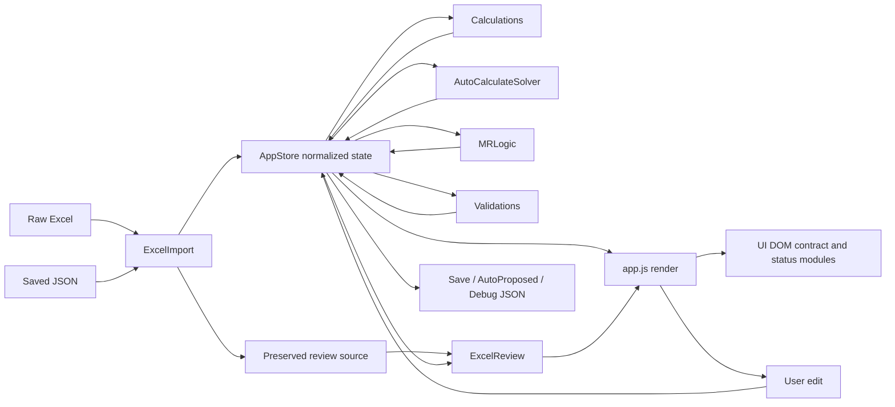

# Architecture

This document describes the current runtime architecture of Pole Span MR Calculator.

## Runtime Model

The application is a static browser application. It has no backend, framework, runtime package dependency, or production build step. GitHub Pages serves the HTML, CSS, and JavaScript files directly.

Node and `package.json` are development tooling only. They provide the dependency-free `npm test` command and do not change how the application runs in the browser.

Every browser module is an IIFE that publishes a small API on `window`.

`index.html` loads modules in dependency order:

1. `libs/xlsx.full.min.js`
2. `js/deployment-version.js`
3. `js/height-utils.js`
4. `js/project-config.js`
5. `js/state.js`
6. `js/calculations.js`
7. `js/midspan.js`
8. `js/mr-logic.js`
9. `js/validations.js`
10. `js/excel-import.js`
11. `js/excel-review.js`
12. `js/json-export.js`
13. `js/compact-autoproposed.js`
14. `js/auto-calculate-solver.js`
15. `js/auto-calculate-source-compat.js`
16. `js/floating-calculator.js`
17. `js/app.js`
18. `js/ui/dom-contract.js`
19. `js/ui/comm-table.js`
20. `js/ui/span-colors.js`
21. `js/ui/runtime.js`

Changing this order can break global dependencies. `auto-calculate-solver.js` needs `Calculations`, `AppStore`, and `HeightUtils`. `auto-calculate-source-compat.js` then wraps SpanSide upsert/state normalization before `app.js` binds the button. The UI runtime loads after the renderer because it annotates and normalizes generated DOM.

## Module Responsibilities

| Module | Global API | Responsibility |
| --- | --- | --- |
| `height-utils.js` | `HeightUtils` | Parse and format height values using integer inches. |
| `project-config.js` | `ProjectProfiles` | Keep INTEC and Metronet defaults outside calculation code. |
| `state.js` | `AppStore` | Own and normalize the single application state. |
| `calculations.js` | `Calculations` | Derive pole limits, power limits, comm midspans, Proposed results, End Drop, recalculation, and flagging. |
| `auto-calculate-solver.js` | `AutoCalculateSolver` | Search TOP/LOW COMM arrangements, rank SAFE/BEST AVAILABLE/CRITICAL results, and install the public Auto Calculate entry point. |
| `auto-calculate-source-compat.js` | `AutoCalculateSourceCompat` | Preserve automatic Proposed source fields through AppStore normalization without changing the core state schema. |
| `midspan.js` | `MidspanLogic` | Small midspan-oriented facade over the store and calculations. |
| `mr-logic.js` | `MRLogic` | Generate ordered Make Ready text for each pole. |
| `validations.js` | `Validations` | Generate broad data-integrity warnings. Table flagging remains in `calculations.js`. |
| `excel-import.js` | `ExcelImport` | Convert Excel worksheets or saved data into normalized AppState entities. |
| `excel-review.js` | `ExcelReview` | Audit preserved workbook rows against current calculated and MR state without rendering HTML. |
| `json-export.js` | `ProjectExport` | Produce general project and diagnostic JSON downloads. |
| `compact-autoproposed.js` | `CompactAutoProposed` | Produce the compact Web-to-plugin payload, apply UG/PCO safety, add movement MR, and manage attachment sizes. |
| `floating-calculator.js` | `FloatingCalculator` | Evaluate feet/inches expressions and normalize two apostrophes into an inch quote. |
| `app.js` | browser event handlers | Render the main UI, process edits, manage undo, Save/Load, Update Data, dialogs, and targeted refreshes. |
| `ui/dom-contract.js` | `UiDomContract` | Annotate rendered cards and tables with stable component, pole, span, and column identities. |
| `ui/comm-table.js` | `CommTableUI` | Hide visual Other Pole HOA without deleting calculation data. |
| `ui/span-colors.js` | `SpanColorUI` | Restart visible span colors per pole and synchronize each Midspan row. |
| `ui/runtime.js` | `PoleCalculatorUI` | Coordinate post-render UI modules through one queued refresh and one workspace observer. |

The quick ownership index is in `FILE_MAP.md`.

## Data Flow

```mermaid
flowchart LR
    A[Raw Excel] --> B[ExcelImport]
    J[Saved JSON] --> B
    B --> C[AppStore normalized state]
    B --> R[Preserved review source]
    C --> D[Calculations]
    D --> C
    C --> S[AutoCalculateSolver]
    S --> C
    C --> E[MRLogic]
    E --> C
    C --> F[Validations]
    F --> C
    C --> G[app.js render]
    G --> U[UI DOM contract and status modules]
    R --> X[ExcelReview]
    C --> X
    X --> G
    G --> H[User edit]
    H --> C
    C --> I[Save / AutoProposed / Debug JSON]
```

A normal edit follows this lifecycle:

1. `app.js` records an undo snapshot.
2. The edit is normalized and written through `AppStore` or `Calculations`.
3. The affected span, pole, remote endpoint, and reciprocal wire rows are recalculated.
4. Make Ready and validations are regenerated.
5. Affected pole cards are rendered again.
6. `PoleCalculatorUI` annotates and normalizes the resulting DOM.
7. The job is marked dirty until Save succeeds.

`render()` also calls `recalculateAll()` before drawing the full workspace. This protects imports, undo restores, loaded JSON, and solver candidates from displaying stale derived values.

## Auto Calculate Search Boundary

`calculations.js` remains authoritative for formulas and validation. `auto-calculate-solver.js` does not duplicate clearance rules. It:

1. Clones the current normalized state.
2. Generates Proposed candidates in integer inches.
3. Builds a TOP COMM downward stack or LOW COMM upward stack.
4. Applies one candidate to a clean state copy.
5. Calls the existing recalculation and flagging APIs.
6. Measures the resulting pole and Midspan issues.
7. Retains the lexicographically best arrangement.

The solver can retain a partial result. A pole-compliant arrangement with a remaining Midspan problem always outranks an arrangement where Midspan passes but the pole fails. UG and PCO remain operator-controlled construction decisions.

User-entered HOA Change and Proposed values are distinguished from values carrying `AUTO` source metadata. Manual values are fixed constraints; automatic values may be replaced during a later run.

## UI Post-render Contract

`app.js` remains the authoritative renderer. The `js/ui/` modules do not own business data and must not replace calculation logic.

The post-render sequence is:

1. Add stable `data-component`, `data-pole-id`, `data-span-id`, and `data-column` values.
2. Remove presentation-only columns such as Other Pole HOA.
3. Re-annotate only if column removal changed the table structure.
4. Apply the per-pole span color sequence to span and Midspan elements.
5. Add or update the per-pole Auto Calculate result card.

Only `ui/runtime.js` observes the pole workspace. Individual UI modules expose synchronous `refresh(root)` functions and do not create competing workspace observers.

## Graph Model

Poles are graph nodes and spans are directed imported edges. Direction is useful for Fore/Back/Other semantics, but calculations compare unordered pole pairs when two records describe the same physical connection.

Collection owns the visible Pole ID. Import and Update Data use `AppStore.canonicalPoleIdentity()` to resolve labels that differ only by trailing `STEEL`, `UG`, or `PCO` descriptors.

Important identities:

- Pole: `poleId`
- Span: `spanId`
- Span side: `spanId + poleId`
- Span comm: `spanId + poleId + owner + wireId`
- Physical connection: sorted pair of `fromPole` and `toPole`

Additional Proposed rows can use a synthetic span with `sourceSpanId`. The synthetic row owns independent Proposed values while inheriting geometry, Environment, and power-derived limits from the physical span.

## Recalculation Scope

| Entry point | Scope |
| --- | --- |
| `recalculateSpan(spanId)` | One span, its endpoints, comm rows, span sides, and End Drop. |
| `recalculateSpansForPole(poleId)` | Connected spans, both endpoints, reciprocal rows matched by Wire ID, MR, and validation. |
| `recalculateAll()` | Every span, pole, comm, Proposed side, MR block, and warning. |
| `AutoCalculateSolver.solvePole(poleId, mode, options?)` | Asynchronous candidate evaluation for one pole plus affected endpoint recalculation. It yields between candidate batches. |
| `Calculations.autoCalculateMovements(options?)` | Installed asynchronous solver entry point that processes every pole once, selectively retries affected improvable poles, and reports UI progress. |

Edits to an endpoint HOA normally use `recalculateSpansForPole` because one movement can affect a midspan displayed from the opposite pole.

## Save, Load, and Update Data

Save serializes the complete normalized state after a full recalculation. Load restores the full state and recalculates derived data. Update Data imports a fresh workbook and then reconciles previous user work by exact identity and physical fallbacks.

Auto-generated HOA/Proposed source markers and `metadata.autoCalculateResult` are part of normalized saved state. A later Auto Calculate run may replace values marked `AUTO`; a user edit clears that marker and becomes fixed input.

Auto Calculate remains on the browser main thread, but yields control between
small candidate batches and poles. This lets the browser paint the progress
overlay and process events during large jobs without changing candidate order
or calculation rules.

Raw Excel Review sheets and Pole Type Check rows are merged by source identity so a partial update does not remove the rest of the job. Derived values and review results are recalculated after merging.

## Compact AutoProposed Export

The formal structural contract is `schemas/autoproposed.schema.json`, with business details in `AUTOPROPOSED_CONTRACT.md`.

- Normal poles may export spans, movements, and terminal attachments.
- PCO poles keep geometry-only local spans and cannot export local movements or terminal attachments.
- Fully UG poles keep geometry-only local spans marked `ug: true` and cannot export local movements or terminal attachments.
- UG takes priority when both UG and PCO are active.
- A blocked pole with no remaining geometry is omitted.

The same module filters generated regular movement lines from UG/PCO replacement Make Ready.

## Project Profiles

`project-config.js` is the extension point for customer defaults.

- INTEC: Top Comm by default, proposed owner visible, Service Drop/Re-sag visible, low-power Proposed MS adjustment enabled.
- Metronet: Low Comm by default, WI selector with MidAm, Service Drop/Re-sag hidden, low-power Proposed MS adjustment disabled.

Auto Calculate supports either position setting for either profile. Profile-specific validations and active equipment actions remain authoritative during candidate evaluation.

## Architectural Invariants

1. Heights are converted to integer inches before arithmetic.
2. Imported values and calculated values remain separate fields.
3. A comm midspan is never borrowed from an unrelated span.
4. Comm-to-comm MS comparisons use rows from the same physical relation defined by current rules.
5. `sourceSpanId` carries physical data for additional Proposed rows.
6. Save and export recalculate before serializing.
7. Reciprocal Fore/Back rows may have different Span/Wire IDs; endpoint-pair matching keeps physical calculations synchronized.
8. Make Ready is generated from current state, not imported Make Ready.
9. Other Pole HOA may be hidden from the DOM but remains available to calculations.
10. Visible span colors restart at `span-color-0` for every pole and Midspan uses the paired span color.
11. UG has priority over PCO for blocked local export behavior.
12. Auto Calculate supports TOP COMM and LOW COMM.
13. Pole compliance outranks Midspan compliance during partial-solution ranking.
14. Auto Calculate never marks UG or PCO automatically.
15. User-entered HOA Change and Proposed values are not overwritten by the solver.

## Safe Extension Points

- Add project defaults in `project-config.js`.
- Add Excel aliases in `excel-import.js`.
- Add normalized fields in constructors and `normalizeState()` together.
- Add formulas or flagging rules in `calculations.js`.
- Add candidate generation/ranking behavior in `auto-calculate-solver.js` without duplicating validations.
- Add Make Ready wording in `mr-logic.js`.
- Add compact Web-to-plugin fields in `compact-autoproposed.js` and update schema, fixtures, and golden output together.
- Add post-render behavior as a small `js/ui/` module with `refresh(root)` and register it in `ui/runtime.js`.
- Do not add another workspace MutationObserver when the unified UI runtime can run the behavior.
