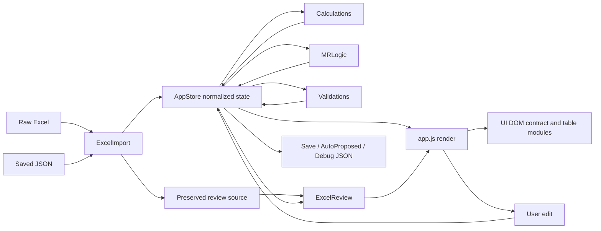

# Architecture

This document describes the current runtime architecture of Pole Span MR Calculator.

## Runtime Model

The application is a static browser application. It has no backend, framework, runtime package dependency or production build step. GitHub Pages serves the HTML, CSS and JavaScript files directly.

Node and `package.json` are development tooling only. They provide the dependency-free `npm test` command and do not change how the application runs in the browser.

Every browser module is an IIFE that publishes a small API on `window`.

`index.html` loads modules in dependency order:

1. `libs/xlsx.full.min.js`
2. `js/height-utils.js`
3. `js/project-config.js`
4. `js/state.js`
5. `js/calculations.js`
6. `js/midspan.js`
7. `js/mr-logic.js`
8. `js/validations.js`
9. `js/excel-import.js`
10. `js/excel-review.js`
11. `js/json-export.js`
12. `js/compact-autoproposed.js`
13. `js/floating-calculator.js`
14. `js/app.js`
15. `js/ui/dom-contract.js`
16. `js/ui/comm-table.js`
17. `js/ui/span-colors.js`
18. `js/ui/runtime.js`

Changing this order can break global dependencies. For example, `calculations.js` expects `window.AppStore` and `window.HeightUtils`; the UI runtime expects the renderer to have loaded before it annotates the generated DOM.

## Module Responsibilities

| Module | Global API | Responsibility |
| --- | --- | --- |
| `height-utils.js` | `HeightUtils` | Parse and format all height values using integer inches. |
| `project-config.js` | `ProjectProfiles` | Keep INTEC and Metronet defaults outside calculation code. |
| `state.js` | `AppStore` | Own and normalize the single application state. |
| `calculations.js` | `Calculations` | Derive pole limits, power limits, comm midspans, Proposed results, End Drop, auto movements and flagging. |
| `midspan.js` | `MidspanLogic` | Small midspan-oriented facade over the store and calculations. |
| `mr-logic.js` | `MRLogic` | Generate ordered Make Ready text for each pole. |
| `validations.js` | `Validations` | Generate broad data-integrity warnings. Table flagging remains in `calculations.js`. |
| `excel-import.js` | `ExcelImport` | Convert Excel worksheets or saved data into normalized AppState entities. |
| `excel-review.js` | `ExcelReview` | Audit preserved workbook rows against current calculated and MR state without rendering HTML. |
| `json-export.js` | `ProjectExport` | Produce general project and diagnostic JSON downloads. |
| `compact-autoproposed.js` | `CompactAutoProposed` | Produce the compact Web-to-plugin payload, apply UG/PCO safety, add movement MR and manage attachment-size configuration. |
| `floating-calculator.js` | `FloatingCalculator` | Evaluate feet/inches expressions and normalize two apostrophes into an inch quote. |
| `app.js` | browser event handlers | Render the main UI, process edits, manage undo, Save/Load, Update Data, dialogs and targeted refreshes. |
| `ui/dom-contract.js` | `UiDomContract` | Annotate rendered cards and tables with stable component, pole, span and column identities. |
| `ui/comm-table.js` | `CommTableUI` | Hide the visual Other Pole HOA column without deleting calculation data. |
| `ui/span-colors.js` | `SpanColorUI` | Restart visible span colors per pole and synchronize each Midspan row. |
| `ui/runtime.js` | `PoleCalculatorUI` | Coordinate post-render UI modules through one queued refresh and one workspace observer. |

The detailed ownership index is in `FILE_MAP.md`.

## Data Flow

```mermaid
flowchart LR
    A[Raw Excel] --> B[ExcelImport]
    J[Saved JSON] --> B
    B --> C[AppStore normalized state]
    B --> R[Preserved review source]
    C --> D[Calculations]
    D --> C
    C --> E[MRLogic]
    E --> C
    C --> F[Validations]
    F --> C
    C --> G[app.js render]
    G --> U[UI DOM contract and table modules]
    R --> X[ExcelReview]
    C --> X
    X --> G
    G --> H[User edit]
    H --> C
    C --> I[Save / AutoProposed / Debug JSON]
```

The store is mutable by design. A normal edit follows this lifecycle:

1. `app.js` records an undo snapshot.
2. The edit is normalized and written through `AppStore` or `Calculations`.
3. The affected span, pole, remote endpoint and reciprocal wire rows are recalculated.
4. Make Ready and validations are regenerated.
5. Affected pole cards are rendered again.
6. `PoleCalculatorUI` annotates and normalizes the resulting DOM.
7. The job is marked dirty until Save succeeds.

`render()` also calls `recalculateAll()` before drawing the full workspace. This protects imports, undo restores and loaded JSON from displaying stale derived values.

Excel Review results live in module memory rather than AppState. The store retains only the original headers and rows needed to rerun the audit. Raw `Anchor` and `Anchor.Guys` snapshots remain separate: the first supports row-completeness checks, while the second supports DG matching and project guy-size rules. A successful raw import or Update Data recalculates the calculator, runs `ExcelReview.runReview()`, then renders without changing the active view. A failed import does not run the review.

## UI Post-render Contract

`app.js` remains the authoritative renderer. The `js/ui/` modules do not own business data and must not replace calculation logic.

The post-render sequence is:

1. Add stable `data-component`, `data-pole-id`, `data-span-id` and `data-column` values.
2. Remove presentation-only columns such as Other Pole HOA.
3. Re-annotate only if column removal changed the table structure.
4. Apply the per-pole span color sequence to span and Midspan elements.

Only `ui/runtime.js` observes the pole workspace. Individual UI modules expose synchronous `refresh(root)` functions and do not create competing workspace observers.

## Graph Model

Poles are graph nodes and spans are directed imported edges. Direction is useful for Fore/Back/Other semantics, but calculations may also compare the unordered pole pair to recognize two records that describe the same physical connection.

Collection owns the visible Pole ID. Import and Update Data use `AppStore.canonicalPoleIdentity()` to resolve relationship labels that differ only by trailing `STEEL`, `UG` or `PCO` descriptors. This prevents status/material text in Span or Span.Wire from creating a second graph node.

Important identities:

- Pole: `poleId`
- Span: `spanId`
- Span side: `spanId + poleId`
- Span comm: `spanId + poleId + owner + wireId`
- Physical connection comparison: sorted pair of `fromPole` and `toPole`

Additional Proposed rows can use a synthetic span with `sourceSpanId`. The synthetic row owns independent Proposed values while inheriting geometry, Environment and power-derived limits from the physical span.

## Recalculation Scope

Use the narrowest calculation entry point that covers the mutation:

| Entry point | Scope |
| --- | --- |
| `recalculateSpan(spanId)` | One span, its endpoints, comm rows, span sides and End Drop. |
| `recalculateSpansForPole(poleId)` | Connected spans, both endpoints, reciprocal rows matched by Wire ID, MR and validation. |
| `recalculateAll()` | Every span, pole, comm, Proposed side, MR block and warning. |

Edits to an endpoint HOA normally use `recalculateSpansForPole` because one movement can affect a midspan displayed from the opposite pole.

## Save, Load and Update Data

Save serializes the complete normalized state after a full recalculation. The first Save in a page session asks for a destination. Later saves overwrite the selected file. A reload or a new raw Excel import clears the active save destination.

Load always opens a JSON picker and restores the full state. The last file handle is used only as a starting-location hint when the File System Access API supports it.

Update Data performs a fresh Excel import and then reconciles previous user work. Exact imported identity is preferred; span, pole, owner and physical relationships are fallbacks. For matched entities, non-empty incoming values win and empty incoming values retain their previous calculator data. Omitted calculator rows are discarded unless they contain manual work or calculation baselines, preventing obsolete spans from recreating blank endpoint comms. Raw Excel Review sheets and Pole Type Check rows are merged by source identity so a partial one-pole update does not remove the rest of the job. Derived fields and review results are recalculated after merging so stale midspans and statuses are not trusted as current results.

## Compact AutoProposed Export

The formal structural contract is `schemas/autoproposed.schema.json`, with business details in `AUTOPROPOSED_CONTRACT.md`.

The exporter recalculates before serialization and applies these pole-level rules inside `compact-autoproposed.js`:

- Normal poles may export spans, movements and terminal attachments.
- PCO poles keep geometry-only local spans and cannot export local movements or terminal attachments.
- Fully UG poles keep geometry-only local spans marked `ug: true` and cannot export local movements or terminal attachments.
- UG takes priority when both UG and PCO are active.
- A blocked pole with no remaining geometry is omitted.

The same module filters generated regular movement lines from UG/PCO replacement Make Ready instead of relying on a later patch script.

## Project Profiles

`project-config.js` is the extension point for customer defaults. Do not scatter new project checks through UI or calculation modules when a setting can represent the difference.

Current profiles:

- INTEC: Top Comm, proposed owner visible, Service Drop and Re-sag Service Drop visible, low-power Proposed MS adjustment enabled.
- Metronet: Low Comm, a dedicated `WI` selector with `MidAm`, Service Drop and Re-sag Service Drop hidden, low-power Proposed MS adjustment disabled. MidAm also supplies crossing defaults, streetlight clearances, wire audit rules and calculated measured Back Span midspans.

The importer normalizes Utility/Power Streetlights, Transformers and Risers into `Pole.metadata.powerEquipment` for both profiles. `calculations.js` converts each supported row and active equipment action into a candidate pole-height ceiling. The UI reads and edits only normalized action fields and never reads raw Equipment-sheet data directly.

Transfer to New Pole remains visible for both profiles because it is a manual movement outcome rather than an imported project-specific attribute.

## Architectural Invariants

These invariants should remain true after future changes:

1. Heights are converted to inches before arithmetic.
2. Imported values and calculated values remain separate fields.
3. A comm midspan is never borrowed from an unrelated span.
4. Comm-to-comm MS comparisons use rows from the same `spanId`.
5. Proposed MS references may include reciprocal records only when they describe the same physical pole pair.
6. `sourceSpanId` carries physical data for additional Proposed rows.
7. Save and export recalculate before serializing.
8. Reciprocal Fore/Back rows may have different Span/Wire IDs; endpoint-pair matching keeps their physical calculations synchronized.
9. Make Ready is generated from current state and does not use imported Make Ready as the final result.
10. Other Pole HOA may be hidden from the DOM but remains available to calculation state.
11. Visible span colors restart at `span-color-0` for every pole and Midspan uses the paired span color.
12. UG has priority over PCO for blocked local export behavior.

## Safe Extension Points

- Add project defaults in `project-config.js`.
- Add Excel header aliases in `excel-import.js` through `pick()` or `heightFromRow()`.
- Add normalized entity fields in constructors and `normalizeState()` together.
- Add a business rule in `calculations.js`, then expose it through the existing compact flagging field.
- Add Make Ready wording in `mr-logic.js` without changing the calculation that produced the movement.
- Add compact Web-to-plugin fields in `compact-autoproposed.js` and update the schema, contract documentation, fixtures and golden output together.
- Add a post-render behavior as a small `js/ui/` module with `refresh(root)` and register it in `ui/runtime.js`.
- Do not add another workspace MutationObserver when the unified UI runtime can run the behavior.
